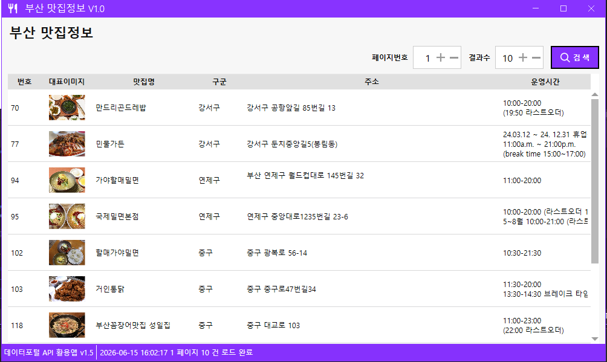
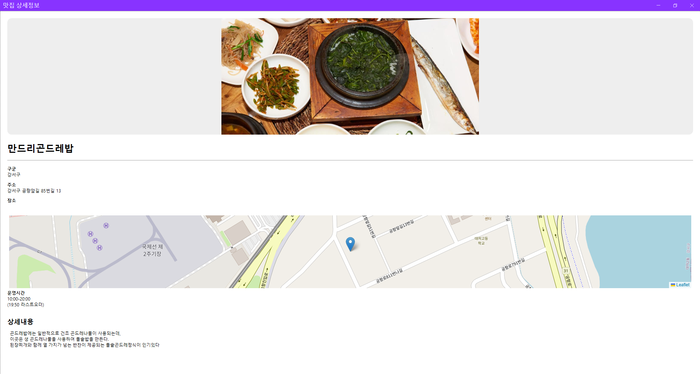

# iot-0615-Quiz
260615 테스트탑 앱 개발 

### 부산 맛집 정보 앱 개발 프로젝트 (IoT/데스크탑 앱)
- 2026년 6월 15일에 진행된 데스크탑 앱 개발 테스트 결과물입니다. 공공데이터포털의 부산광역시 맛집 정보를 활용하여 사용자에게 편리한 검색과 상세 정보를 제공하는 WPF 데스크탑 애플리케이션입니다.

- 날짜: 2026년 6월 15일

- 기술 스택: .NET 6/8, WPF (Windows Presentation Foundation), MahApps.Metro (UI 프레임워크), CefSharp (지도 표시), Newtonsoft.Json (데이터 파싱)

- 목표: 부산광역시 공공데이터 API를 연동하여 맛집 데이터를 시각화하고 상세 정보를 제공하는 데스크탑 앱 개발

- 주요 개발 과정 (Step-by-Step)

1. 프로젝트 초기 설정:

    - WPF 프로젝트 생성 및 MahApps.Metro 라이브러리 도입을 통한 현대적인 UI 구성.

    - CefSharp 라이브러리를 추가하여 상세 페이지 내 지도 표시 기능 구현.

2. 데이터 모델링:

    - API 응답 JSON 구조를 분석하여 FoodApiResponse, FoodItem 모델 클래스 정의.

    - JsonProperty를 활용한 데이터 매핑 및 ObservableCollection을 활용한 리스트 바인딩.

3. UI/UX 디자인:

    - MainWindow: 검색창, 페이지 설정 및 맛집 목록을 보여주는 DataGrid 구현.

    - FoodDetailWindow: 선택된 맛집의 상세 정보, 운영 시간, 지도, 홈페이지 링크를 제공하는 상세 페이지 설계.

    - 아이콘 및 레이아웃 커스텀(MahApps 아이콘 팩 사용)을 통한 사용자 친화적 디자인.

4. 기능 구현:

    - 검색: 페이지 번호와 결과 수를 선택하여 API 데이터를 호출하는 검색 기능.

    - 상세 페이지: 목록 더블 클릭 시 FoodDetailWindow를 띄워 상세 정보를 바인딩.

    - 지도 구현: Leaflet 라이브러리와 CefSharp 브라우저 컨트롤을 조합하여 정확한 맛집 위치 표시.

    - 데이터 처리: HTML 형태의 상세 내용을 텍스트로 변환하여 RichTextBox에 출력.

- 주요 구현 기능

    - 맛집 목록 조회: 데이터 그리드를 통해 번호, 이미지, 맛집명, 위치, 운영 시간 확인.

    - 상세 정보 확인: 더블 클릭을 통한 상세 페이지 이동 및 상세 내용 표시.

    - 실시간 지도: 해당 맛집 위치를 브라우저 컴포넌트를 통해 실시간 지도 출력.

    - 페이지네이션: 사용자가 원하는 만큼 데이터를 페이지 단위로 검색.

- 프로젝트 성과

    - 공공데이터 API의 계층적 구조를 객체 지향적으로 해석하여 매핑하는 능력 배양.

    - UI 컨트롤과 C# 백엔드 간의 데이터 바인딩 로직 완벽 이해.

    - CefSharp을 이용한 하이브리드(WPF + 웹 기술) 앱 개발 경험.

